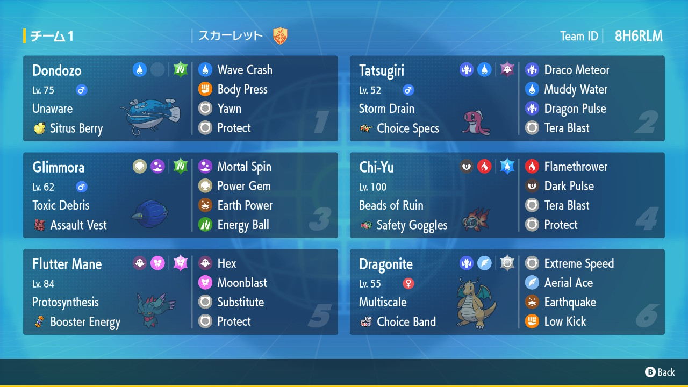
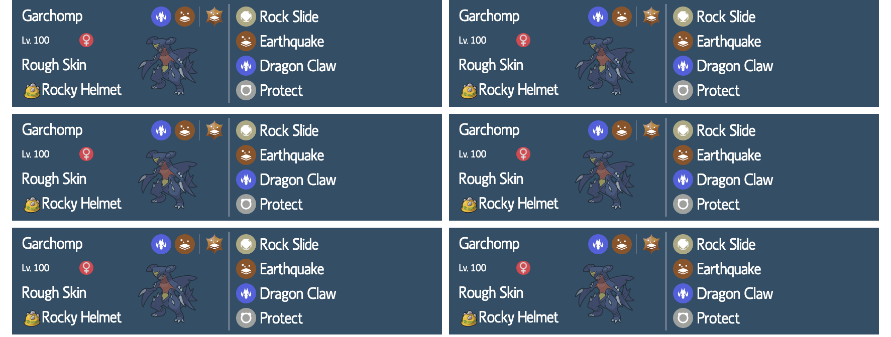

# poketeam
A project I created to practice CSS flexbox and grid layouts.

I wanted to create something similar to the team previews in Pokémon Scarlet and Violet:

## Nov 7 2023
Here is the result I have so far:

I tried using Figma to mock up the design: https://www.figma.com/file/tAMXcxCckMfXicWZHkrIAh/Pok%C3%A9team?type=design&node-id=0-1&mode=design. I didn't find it very useful, as the Anima plugin in Figma only produces HTML code using 'position: absolute' to position elements. I wanted to make the design responsive, so I thought about where I would add breakpoints and how the design would change depending on the size of the screen. Each individual "card" containing a Pokémon's information was already crowded, and so I decided that at smaller screen sizes, I would move the Pokémon's four moves below the other information in the card in a 2-by-2 grid. At mid-sized screens, I decided that the design should be a signle column with each row showing a single Pokémon's information. Finally, at larger screen sizes, I would show the cards as they appear in the image above, that is, two to a column. I learned that my initial approach of using a Figma mock up would not help me much - there were quite a few styles I had to apply to capture the original card layout - and that I needed to think more about the overall structure of the card. By thinking first about how the elements in a card would appear and testing out different breakpoints based on that insight, I was able to arrive at a working design. I may polish the design up at a later date to get it closer to the appearance in the actual team previews. I would also like to add functionality that, with the press of a button, randomly creates a team of six Pokémon and displays it on the page. I would also like to add a feature that copies the information of the team to a user's clipboard so that he/she can save it for later.